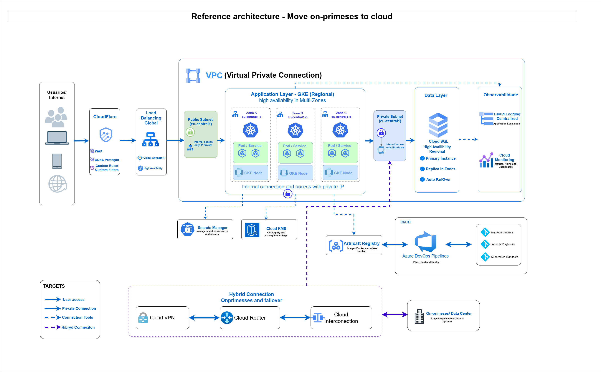

# Proposed Architecture Overview


link: https://drive.google.com/file/d/1UeQPTQ6hfuBZqKyxUR0AvLbh0ofEXm3-/view?usp=sharing

## 1. Ingress & Edge Layer
To ensure a secure and resilient entry point, I opted for a **Global Cloud Load Balancing** setup. This gives us a single public VIP, managed SSL/TLS certificates, and distributed health checks right at the edge. 

To protect the application from common web vulnerabilities and brute-force traffic, I would place **Cloud Armor** in front of the load balancer for WAF rules, rate limiting, and basic DDoS mitigation. Depending on the environment strategy, we can leverage a single global frontend or spin up separate, dedicated load balancers to isolate Dev, Stage, and Prod.

## 2. Application Tier
For the web and application tier, my go-to choice would be either **GKE Autopilot** or **Managed Instance Groups (MIGs)** with autoscaling, depending on how the application is currently architected:
* **If it's containerized:** GKE is the most flexible route. It naturally handles rapid scaling, rolling updates, and workload isolation.
* **If we need a quick "lift-and-shift":** A MIG using Linux instances combined with startup scripts provides the shortest path to migration without immediate containerization overhead.

## 3. Database Strategy
I highly recommend moving away from the on-premise MySQL setup and migrating to **Cloud SQL for MySQL** configured with **Regional High Availability (HA)**. 

To ensure data durability and operational safety, we should enable automated backups, point-in-time recovery (PITR), and scheduled maintenance windows. If the application becomes highly read-intensive later on, we can easily scale by adding read replicas, but for the initial phase, a regional HA setup effectively solves our main redundancy pain points.

## 4. Logging & Observability
We need to move away from local file logging. My approach is to stream all logs directly to **Cloud Logging**. 

For metrics and alerting, I’d set up **Cloud Monitoring** to build dashboards and track core Golden Signals (latency, error rates, and saturation) mapped to clear SLOs. If there is a legacy Nagios setup currently running, we can let it coexist temporarily during the transition, but the ultimate goal is to consolidate everything into GCP's native observability suite for a single pane of glass.

---

## Networking & Security

### Network Segmentation (VPC Design)
To enforce strict boundaries, I would design either a single VPC per environment or a **Shared VPC** architecture spanning separate Google Cloud projects, depending on the organization's governance maturity. 

Within the network, I’d isolate subnets by function:
* A **public subnet** for the load balancers and edge components.
* A **private application subnet** for the backend workloads (VMs/Pods).
* A **private database subnet** dedicated strictly to the Cloud SQL instances.

To allow our private instances to fetch patches or talk to external APIs securely without exposing public IPs, I’d deploy **Cloud NAT**.
```
[Internet]
│
▼
[Cloud Armor + Global ALB] (Public Subnet)
│
▼
[GKE / MIG App Tier]       (Private App Subnet) ──► [Cloud NAT] ──► [External APIs]
│
▼
[Cloud SQL HA]             (Private DB Subnet)
```

### Internal Connectivity & Hybrid Networking
The application must communicate with the database exclusively over private IPs. We can achieve this cleanly using **Private Service Connect (PSC)** or private IP networking for Cloud SQL to completely bypass the public internet. 

Durante a fase de migração parcial, se as cargas de trabalho na nuvem precisarem se comunicar com a infraestrutura on-premise remanescente, podemos estabelecer um túnel seguro usando **HA Cloud VPN** ou uma linha dedicada do **Cloud Interconnect**.

### Security & Hardening
Security should follow the principle of least privilege. I’d implement dedicated **IAM Service Accounts** per workload, and if we go down the GKE route, I’d enforce **Workload Identity** to map Kubernetes service accounts to IAM roles securely.

* **Secrets Management:** All sensitive credentials and API keys go into **Secret Manager**—never hardcoded in code or exposed in state files.
* **Encryption:** If the business requires full ownership of encryption keys, we can back our data with **Customer-Managed Encryption Keys (CMEK)** via Cloud KMS. Otherwise, standard Google-managed encryption is active by default.
* **In-Transit:** We enforce TLS end-to-end externally, and internally between the application and the database wherever supported.

---

## High Availability & Resilience

### Designing out Single Points of Failure (SPOFs)
I designed this architecture to be resilient at every single layer:
* **Ingress:** The Global Load Balancer inherently removes any dependency on a single hardware appliance.
* **Compute:** Deploying the application across multiple zones protects us from host or data center failures.
* **Data:** Cloud SQL's regional HA automatically fails over to a secondary zone if the primary goes down.
* **Storage:** All assets, backups, and artifacts will sit in **Cloud Storage (GCS)** utilizing object versioning and retention policies.

For an advanced disaster recovery (DR) scenario, we could eventually replicate the stack across an entirely different GCP region, using DNS failover or traffic splitting to manage contingencies.

---

## Infrastructure as Code (IaC) & CI/CD

### IaC Strategy
To keep the infrastructure reproducible, I'd manage everything through **Terraform**, organizing resources into reusable modules for networking, security, compute, and database. 

We would strictly separate environment states (Dev, Stage, Prod) using remote backends in Cloud Storage with state locking enabled. To catch security risks early, I like to integrate **Policy-as-Code** checks directly into the PR workflow using tools like `terraform validate`, `tflint`, and `checkov` before any human approval.

### CI/CD Pipeline Flow
Here is the automated workflow I propose for deployment:
1. **Developer Commits Code** to the repository.
2. **CI Pipeline Triggers:** Runs linters, automated tests, and security scans.
3. **Dry Run:** Executes a `terraform plan` to preview infrastructure changes.
4. **Gatekeeping:** Requires a manual approval sign-off for Stage and Prod environments.
5. **Execution:** Runs `terraform apply` to provision or update infrastructure.
6. **Application Deployment:** Deploys the code using rolling updates or canary strategies to eliminate downtime.

For containerized apps, I prefer using **Cloud Build** or **GitHub Actions** to handle the Docker build, run image vulnerability scans, push the image to **Artifact Registry**, and finally update the GKE deployment. We ensure environment promotion relies on the exact same immutable container image, simply injecting different environment variables and secrets per stage.

---

## Hybrid Coexistence & Failover Strategy

### Partial Migration Approach
To minimize risk during the transition, the best approach is a hybrid **active-passive** or **partial active-active** model. 

Initially, we keep the on-premise environment as the primary production source and spin up an identical, equivalent stack inside GCP. We can synchronize the MySQL data by setting up replication to Cloud SQL (or to a temporary MySQL instance on a Compute Engine VM if there are specific version alignment constraints).

We can manage traffic cutting via DNS failover or an intelligent load balancer backed by robust health checks. This allows us to smoothly shift traffic over to GCP or gracefully fail over if the on-premise infrastructure experiences downtime. 

To ensure this failover is seamless, the application code must remain strictly identical on both sides, with all states externalized to the database or object storage so that individual nodes never rely on local disks. Lastly, centralized cloud logging and metrics will be live from day one, giving us full observability into both environments during the entire migration window.

---

### High-Level Architecture Flow (Summary)
> **Users** ──► Cloud Armor ──► Global HTTP(S) LB ──► GKE / MIG (App Tier) ──► Cloud SQL (MySQL HA)
> * **Observability:** App Tier streams logs to Cloud Logging & metrics to Cloud Monitoring.
> * **Storage & Assets:** Backups and static artifacts are stored in Cloud Storage.
> * **Automation:** Infrastructure and deployments are driven by Cloud Build + Terraform + Artifact Registry.
> * **Hybrid Network:** Dedicated Interconnect / HA VPN handles secure data replication from On-Prem.

### High-Level susgest Ansible and Terraform Manifests

```
repos/
├── terraform/
│   ├── modules/
│   │   ├── network/
│   │   ├── firewall/
│   │   ├── gke/
│   │   ├── cloudsql_mysql/
│   │   ├── logging_monitoring/
│   │   ├── artifact_registry/
│   │   ├── kms/
│   │   ├── secret_manager/
│   │   ├── iam/
│   │   ├── lb_http_https/
│   │   ├── cloud_armor/
│   │   ├── cloud_storage/
│   │   └── hybrid_connectivity/
│   ├── envs/
│   │   ├── dev/
│   │   │   ├── main.tf
│   │   │   ├── providers.tf
│   │   │   ├── backend.tf
│   │   │   ├── variables.tf
│   │   │   ├── terraform.tfvars
│   │   │   └── outputs.tf
│   │   ├── stage/
│   │   └── prod/
│   ├── policies/
│   │   ├── tfsec/
│   │   ├── checkov/
│   │   └── opa/
│   ├── scripts/
│   └── README.md
├── ansible/
│   ├── inventories/
│   │   ├── dev/
│   │   ├── stage/
│   │   └── prod/
│   ├── roles/
│   │   ├── common/
│   │   ├── docker/
│   │   ├── nginx/
│   │   ├── app/
│   │   ├── monitoring_agent/
│   │   ├── logging_agent/
│   │   └── hardening/
│   ├── playbooks/
│   │   ├── site.yml
│   │   ├── app.yml
│   │   ├── hardening.yml
│   │   └── monitoring.yml
│   ├── group_vars/
│   ├── host_vars/
│   ├── ansible.cfg
│   ├── requirements.yml
│   └── README.md

```